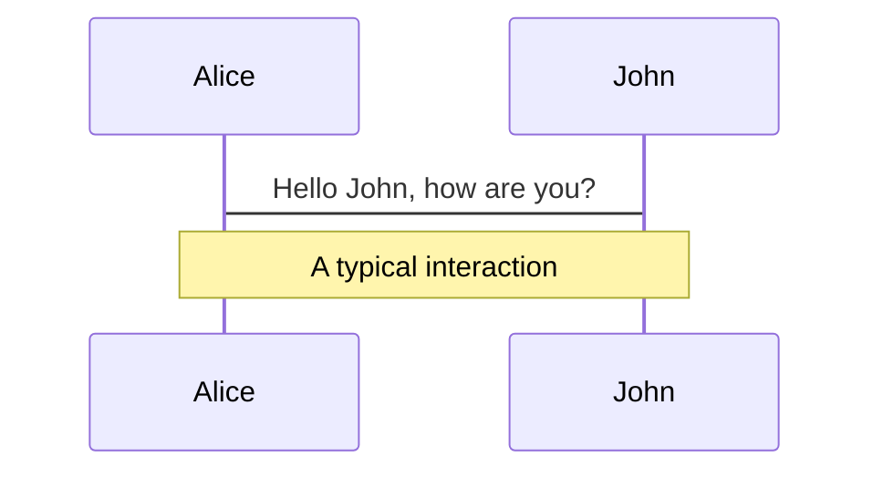
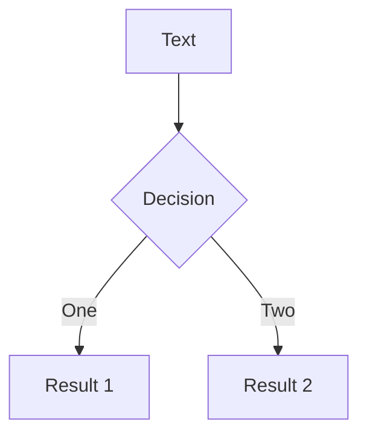
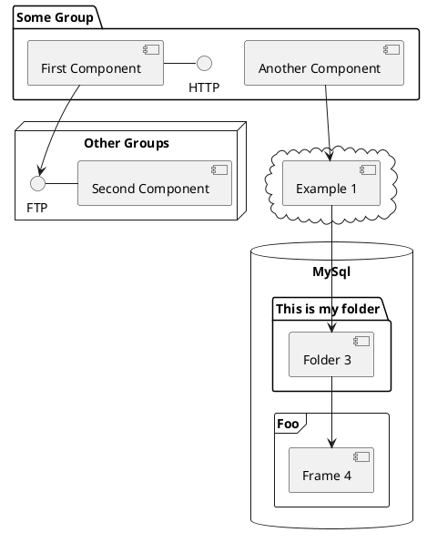

---
# try also 'default' to start simple
theme: seriph
# random image from a curated Unsplash collection by Anthony
# like them? see https://unsplash.com/collections/94734566/slidev
background: https://source.unsplash.com/collection/94734566/1920x1080
# apply any windi css classes to the current slide
class: 'text-center'
# https://sli.dev/custom/highlighters.html
highlighter: shiki
# show line numbers in code blocks
lineNumbers: false
# some information about the slides, markdown enabled
info: |
  ## Slidev Starter Template
  Presentation slides for developers.

  Learn more at [Sli.dev](https://sli.dev)
# persist drawings in exports and build
drawings:
  persist: false
---

# 2021年フロントエンドまとめ

---

# 今日話すこと

- フロントエンド開発に必要な基本技術
- ライブラリ・フレームワークの話
- ホスティングサービスの話

<br>
<br>

<style>
h1 {
  background-color: #2B90B6;
  background-image: linear-gradient(45deg, #4EC5D4 10%, #146b8c 20%);
  background-size: 100%;
  -webkit-background-clip: text;
  -moz-background-clip: text;
  -webkit-text-fill-color: transparent;
  -moz-text-fill-color: transparent;
}
</style>

---

# フロントエンド開発に必要な基本技術
- HTML
- CSS
- JavaScript

<p>HTMLでマークアップを行い、CSSで見た目を調整して、JavaScriptでプログラムを書くという基本的な構成要素は変わっていない。</p>
<p>フロントエンドに関しては、今年も来年も変わらず、HTML・CSS・JavaScriptが大事！</p>

---

# 2021年のJavaScriptライブラリの使用状況
<div class="flex">
  <div class="img">
    
    <span class="quote">引用: <a href="https://insights.stackoverflow.com/survey/2021" target="_blank" rel="noopener noreferrer">Stack Overflow</a></span>
  </div>
  <div class="text">
    <p>Stack Overflowが行った2021年のウェブフレームワークの使用率の調査結果から以下の傾向が分かる。</p>
    <ul>
      <li>世界的に見ると、VueよりもReactの方がかなり使用率が高い</li>
      <li>Reactが最も使用されるウェブフレームワークとして、jQueryを上回った</li>
    </ul>
  </div>
</div>

<style>
.flex {
  display: flex;
  justify-content: space-between;
}

.text {
  width: 50%;
}

.quote {
  font-size: 14px;
}

.img {
  width: 50%;
}

.img img {
  display: block;
  max-width: 300px; 
  height: auto;
  margin-bottom: 8px;
}

p, ul {
  font-size: 16px;
}
</style>
---

# 2021年のReact
<h2 class="heading">今年の大きな動き</h2>
<p>React自体の大きな変化や仕様変更は特になし。<br>フレームワークに関しては、Next.jsがJSフレームワークの覇権を握っていると言っても過言ではないような状況になっている。</p>

<h2 class="heading">来年以降に予想される大きな動き</h2>
<p>React Conf 2021で、メモ化を自動的に行うコンパイラが発表された。</p>


<style>
.heading {
  font-size: 26px !important;
  margin-top: 0;
  margin-bottom: 10px !important;
  line-height: 1.2 !important;
}
img {
  display: block;
  max-width: 380px; 
  height: auto;
}
</style>
---

# Next.jsって何がすごいのか
<ol>
  <li>複数のHTML生成戦略を持つことができる</li>
  <li>Reactの知見があれば、特に学習しなくてもすぐに使うことができる</li>
  <li>ルーティングを簡単に定義できる機能や、画像・CSS・JSの最適化、サーバーサイドでNode.jsを簡単にできる機能など便利機能がたくさんある</li>
</ol>

<h2 class="heading">複数のHTML生成戦略とは？</h2>
<ul>
  <li><strong class="strong">SG (Static Generation)</strong> → Node.jsを使用して、静的なHTMLファイルを事前生成する手法。</li>
  <li><strong class="strong">SSR (Server-Side Rendering)</strong> → アクセス時にサーバーサイドでHTMLファイルを生成する手法。</li>
  <li><strong class="strong">ISR (Incremental Static Regeneration)</strong> → リクエスト時にページのキャッシュを作成して、バックエンド側で次のアクセスに向けたキャッシュの再生成を行うことでHTMLを生成する手法。</li>
</ul>

<span class="important">ISRはユーザーのアクセスをトリガーにデータの更新が行われるので、ある程度ユーザーからアクセスがあるサイト・サービスであることが前提条件</span>

<style>
.heading {
  font-size: 26px !important;
  margin-top: 0;
  margin-bottom: 10px !important;
  line-height: 1.2 !important;
}

.strong {
  color: cornflowerblue;
}

.important {
  color: #f44336;
}
</style>
---

# Reactにおけるメモ化って何？
<p>Reactにおけるパフォーマンスチューニングの方法の一つ</p>
<p>依存する値が変化した時のみ再レンダリングを行うuseMemoと依存する値が変化した時のみ処理を実行するuseCallbackの2種類が存在する。<br />メモ化を利用することで、不要なレンダリングを抑制することができパフォーマンスチューニングにつながる</p>

useMemo
```ts
const sortedPosts = useMemo(() => {
  return posts;
}, [posts]);
```

useCallback
```ts
const memoizedCallback = useCallback(() => {
  // 中に渡した関数
  doSomething(a, b);
}, [a, b]);
```
---

# 2021年のVue
<h2 class="heading">今年の大きな動き</h2>
<ul>
  <li>Vue3 Composition APIがだいぶ普及してきた</li>
  <li>Nuxt3 Beta版のリリース</li>
</ul>
---

# Vue3 Composition APIとは？
<h2 class="heading">今年の大きな動き</h2>
<ul>
  <li>Vue3 Composition APIがだいぶ普及してきた</li>
  <li>Nuxt3 Beta版のリリース</li>
</ul>
---

# Nuxt3のすごいところ
---

# どのホスティングサービスがおすすめ！？
---

# ホスティングサービスの話
<p></p>
---

# まとめ
<p></p>

---

# Navigation

Hover on the bottom-left corner to see the navigation's controls panel, [learn more](https://sli.dev/guide/navigation.html)

### Keyboard Shortcuts

|     |     |
| --- | --- |
| <kbd>right</kbd> / <kbd>space</kbd>| next animation or slide |
| <kbd>left</kbd>  / <kbd>shift</kbd><kbd>space</kbd> | previous animation or slide |
| <kbd>up</kbd> | previous slide |
| <kbd>down</kbd> | next slide |

<!-- https://sli.dev/guide/animations.html#click-animations -->

<p v-after class="absolute bottom-23 left-45 opacity-30 transform -rotate-10">Here!</p>

---
layout: image-right
image: https://source.unsplash.com/collection/94734566/1920x1080
---

# Code

Use code snippets and get the highlighting directly![^1]

```ts {all|2|1-6|9|all}
interface User {
  id: number
  firstName: string
  lastName: string
  role: string
}

function updateUser(id: number, update: User) {
  const user = getUser(id)
  const newUser = {...user, ...update}  
  saveUser(id, newUser)
}
```

<arrow v-click="3" x1="400" y1="420" x2="230" y2="330" color="#564" width="3" arrowSize="1" />

[^1]: [Learn More](https://sli.dev/guide/syntax.html#line-highlighting)

<style>
.footnotes-sep {
  @apply mt-20 opacity-10;
}
.footnotes {
  @apply text-sm opacity-75;
}
.footnote-backref {
  display: none;
}
</style>

---

# Components

<div grid="~ cols-2 gap-4">
<div>

You can use Vue components directly inside your slides.

We have provided a few built-in components like `<Tweet/>` and `<Youtube/>` that you can use directly. And adding your custom components is also super easy.

```html
<Counter :count="10" />
```

<!-- ./components/Counter.vue -->
<Counter :count="10" m="t-4" />

Check out [the guides](https://sli.dev/builtin/components.html) for more.

</div>
<div>

```html
<Tweet id="1390115482657726468" />
```

<Tweet id="1390115482657726468" scale="0.65" />

</div>
</div>


---
class: px-20
---

# Themes

Slidev comes with powerful theming support. Themes can provide styles, layouts, components, or even configurations for tools. Switching between themes by just **one edit** in your frontmatter:

<div grid="~ cols-2 gap-2" m="-t-2">

```yaml
---
theme: default
---
```

```yaml
---
theme: seriph
---
```


</div>

Read more about [How to use a theme](https://sli.dev/themes/use.html) and
check out the [Awesome Themes Gallery](https://sli.dev/themes/gallery.html).

---
preload: false
---

# Animations

Animations are powered by [@vueuse/motion](https://motion.vueuse.org/).

```html
<div
  v-motion
  :initial="{ x: -80 }"
  :enter="{ x: 0 }">
  Slidev
</div>
```

<div class="w-60 relative mt-6">
  <div class="relative w-40 h-40">
    
    
    
  </div>

  <div
    class="text-5xl absolute top-14 left-40 text-[#2B90B6] -z-1"
    v-motion
    :initial="{ x: -80, opacity: 0}"
    :enter="{ x: 0, opacity: 1, transition: { delay: 2000, duration: 1000 } }">
    Slidev
  </div>
</div>

<!-- vue script setup scripts can be directly used in markdown, and will only affects current page -->
<script setup lang="ts">
const final = {
  x: 0,
  y: 0,
  rotate: 0,
  scale: 1,
  transition: {
    type: 'spring',
    damping: 10,
    stiffness: 20,
    mass: 2
  }
}
</script>

<div
  v-motion
  :initial="{ x:35, y: 40, opacity: 0}"
  :enter="{ y: 0, opacity: 1, transition: { delay: 3500 } }">

[Learn More](https://sli.dev/guide/animations.html#motion)

</div>

---

# LaTeX

LaTeX is supported out-of-box powered by [KaTeX](https://katex.org/).

<br>

Inline $\sqrt{3x-1}+(1+x)^2$

Block
$$
\begin{array}{c}

\nabla \times \vec{\mathbf{B}} -\, \frac1c\, \frac{\partial\vec{\mathbf{E}}}{\partial t} &
= \frac{4\pi}{c}\vec{\mathbf{j}}    \nabla \cdot \vec{\mathbf{E}} & = 4 \pi \rho \\

\nabla \times \vec{\mathbf{E}}\, +\, \frac1c\, \frac{\partial\vec{\mathbf{B}}}{\partial t} & = \vec{\mathbf{0}} \\

\nabla \cdot \vec{\mathbf{B}} & = 0

\end{array}
$$

<br>

[Learn more](https://sli.dev/guide/syntax#latex)

---

# Diagrams

You can create diagrams / graphs from textual descriptions, directly in your Markdown.

<div class="grid grid-cols-3 gap-10 pt-4 -mb-6">







</div>

[Learn More](https://sli.dev/guide/syntax.html#diagrams)


---
layout: center
class: text-center
---

# Learn More

[Documentations](https://sli.dev) · [GitHub](https://github.com/slidevjs/slidev) · [Showcases](https://sli.dev/showcases.html)
